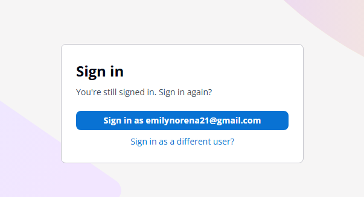

# 🧩 Frontend – JavaScript + AWS S3

## 📌 Proyecto: Twitter Experimental Frontend

**Autores:**  
- David Espinosa  
- Emily Noreña  

---

### 🧠 Descripción general
Aplicación web en **JavaScript / HTML / CSS** que consume la API desplegada en AWS Lambda.  
Permite:
- Registrar usuarios
- Iniciar sesión
- Crear posts de hasta 140 caracteres
- Visualizar el stream global de publicaciones

---

### ⚙️ Tecnologías utilizadas
- **HTML5 / CSS3**
- **JavaScript (ES6)**
- **Fetch API**
- **AWS S3 (hosting)**
- **AWS CloudFront (opcional)**
- **JWT Authentication**

---

### 🧭 Estructura del proyecto
```
/frontend
 ├── index.html
 ├── styles.css
 ├── app.js
 └── assets/
```

---

### 🚀 Despliegue en AWS S3
1. Crear bucket S3 → **Enable Static Website Hosting**
2. Subir archivos (`index.html`, `app.js`, etc.)
3. Desactivar “Block all public access”.
4. Activar **Static website hosting**:
   - Index document: `index.html`
   - Error document: `index.html`
5. Acceder mediante la URL pública del bucket.


---

### 🔗 Conexión con el Backend
```js
const API_URL = "https://<api-gateway-url>/prod";

async function postMessage(content) {
  const response = await fetch(`${API_URL}/api/posts`, {
    method: "POST",
    headers: {
      "Content-Type": "application/json",
      "Authorization": `Bearer ${token}`
    },
    body: JSON.stringify({ content })
  });
  return await response.json();
}
```

---

### 🔐 Autenticación con JWT



---

### 🧪 Pruebas


---

### 📚 Bibliografía
- AWS S3 Static Hosting – https://docs.aws.amazon.com/AmazonS3/latest/userguide/WebsiteHosting.html  
- JavaScript Fetch API – https://developer.mozilla.org/es/docs/Web/API/Fetch_API  
- AWS API Gateway – https://docs.aws.amazon.com/apigateway/latest/developerguide/
